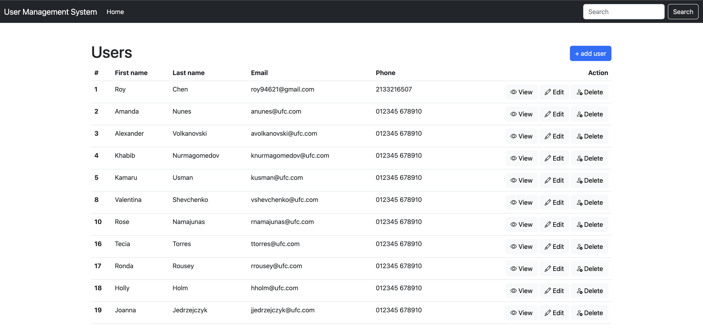
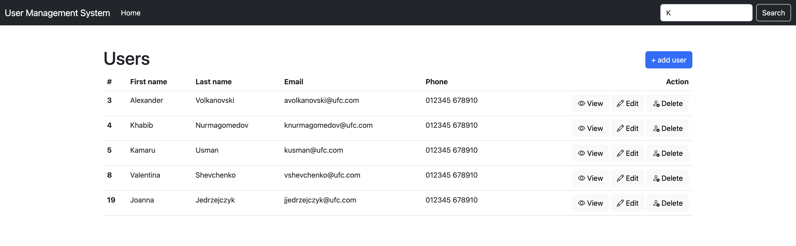
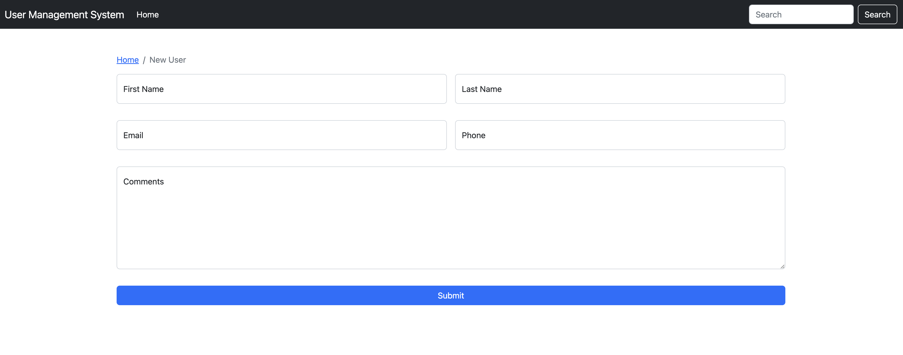
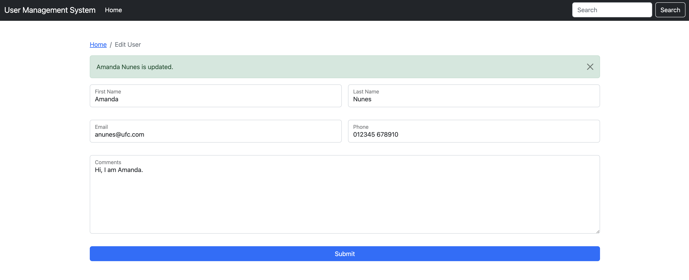
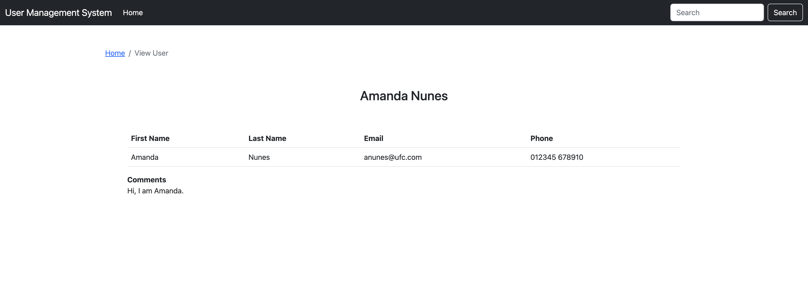

# User-Management-System
A web application for user information management using Node.js, express, express-handlebars & NoSQL database. This is a project based on Raddy's toturial [[link]].

[link]: https://raddy.dev

# Usage
1. Initialize new project
```
npm init
```

2. Install all needed packages
```
npm install express dotenv express-handlebars body-parser mysql2
```

3. Run the app
```
node app.js
```
After seeing `Listening on port 8080` on your console, the server is running correctlly.

4. Open your browser and search `localhost:8080`.

# Overview
### Home Page


### Search User by Name
> Search the user data based on first name and last name. For example, searching the name according to the input `K`.



### Add User
> After clicking the "+ Add User" button, this form will be showed for filling the new user information.



### Edit User


### View Usesr


### Reference
1. [Simple User Management System – Nodejs, Express, MySQL & Handlebars](https://raddy.dev/blog/simple-user-management-system-nodejs-express-mysql-handlebars/)

2. [A Step By Step Guide To Using Handlebars With Your Node js App](https://waelyasmina.medium.com/a-guide-into-using-handlebars-with-your-express-js-application-22b944443b65)
